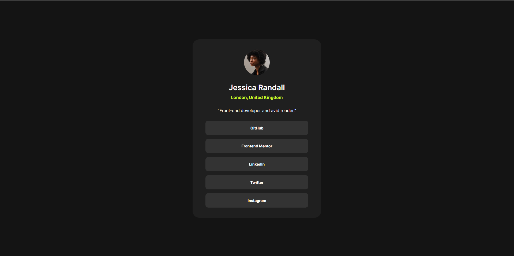

# Frontend Mentor - Social links profile solution

This is a solution to the [Social links profile challenge on Frontend Mentor](https://www.frontendmentor.io/challenges/social-links-profile-UG32l9m6dQ). Frontend Mentor challenges help you improve your coding skills by building realistic projects. 

## Table of contents

- [Overview](#overview)
  - [The challenge](#the-challenge)
  - [Screenshot](#screenshot)
  - [Links](#links)
- [My process](#my-process)
  - [Built with](#built-with)
  - [What I learned](#what-i-learned)
  - [Useful resources](#useful-resources)
- [Author](#author)

## Overview

### The challenge

Users should be able to:

- See hover and focus states for all interactive elements on the page

### Screenshot

### Links

- Solution URL: https://github.com/D-One-Dev/frontendMentorLinksProfile
- Live Site URL: https://d-one-dev.github.io/frontendMentorLinksProfile/

## My process

### Built with

- Semantic HTML5 markup
- CSS custom properties
- Flexbox
- Adaptive scaling
- CSS media querries

### What I learned

I've learned how to add fonts from local files. I've also practised creating adaptive UI using percentage values and CSS media querries.

### Useful resources

- [mdn web docs](https://developer.mozilla.org/) - Like Wikipedia but for frontenders. Any html/css concept is explained here.

## Author

- [GitHub](https://github.com/D-One-Dev/)
- Frontend Mentor - [@D-One-Dev](https://www.frontendmentor.io/profile/D-One-Dev)
